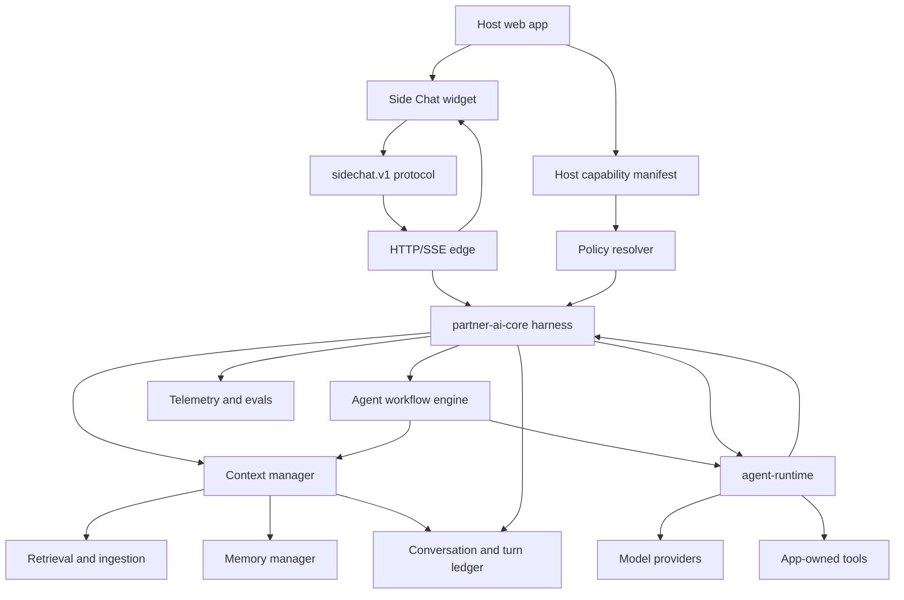

# Side Chat Production System Design

Date: 2026-06-13

Status: target architecture for the next build phase

Implementation plan: `docs/architecture/implementation-plan.md`.

Scope: this document reviews `chat-reference` as the project under assessment. The `learn` course and `learn/scribe` implementation are used as the benchmark for what the project should grow into. This is a project architecture document, not a learning-gap report.

Product framing: `chat-reference` is intended to be a framework for embedding AI capabilities into ordinary web applications. That means it cannot be designed as one chatbot with one prompt and one tool. It needs reusable modules for context, tools, retrieval, memory, workflows, observability, evals, and host-app capability registration.

## Main Message

The desired final state is a production AI harness where the host app registers capabilities, `partner-ai-core` prepares and governs each turn, `agent-runtime` executes a prepared turn, and durable records make every model-visible decision reconstructable.

The final system should not be:

```text
current user message -> model stream -> SSE -> post-hoc persistence
```

It should be:

```text
host capability manifest
-> policy/profile resolution
-> conversation and turn lifecycle
-> context manager
-> optional workflow engine
-> agent runtime
-> streamed protocol events
-> durable event/tool/usage/context records
-> compaction, memory extraction, and eval feedback
```

The biggest design move is to make `partner-ai-core` the product harness module. It should own turn preparation, context management, profile policy, tool policy, workflow orchestration, lifecycle persistence, and audit decisions. `agent-runtime` should stay generic: it receives an already prepared request and runs the provider/tool loop.

## Target Architecture at a Glance



## Architecture Principles

1. The harness has one owner for "what the model sees." That owner is the context manager in `partner-ai-core`.
2. Every model-visible input has provenance, trust level, budget cost, and a manifest entry.
3. Host apps register capabilities. They do not hand arbitrary tools and context directly to the model.
4. Tool registration is not permission. Tool exposure is resolved per turn or per workflow node.
5. Assistant turns are durable before model execution, not reconstructed after streaming.
6. Long conversations are expected. Truncation, compaction, summaries, and memory are first-class harness behavior.
7. Multi-agent work is not just "call another model." It needs workflow state, isolated context, budgets, artifacts, handoffs, and audit.
8. `agent-runtime` executes prepared turns. It does not decide product context policy.
9. Effect layers should describe production resources, config, and adapters, including startup, shutdown, and typed failures.
10. Evals are part of the harness, not a later polish step.

## Final Module Map

The target architecture should be organized around these deep modules. "Deep" here means each module gives callers high leverage through a small interface, while keeping detailed behavior local to the module.

| Module | Final responsibility | Current state |
| --- | --- | --- |
| Host capability manifest | Describes host-provided tools, commands, retrieval sources, workflows, profiles, approvals, and UI activity renderers | Host bridge and runtime tools exist, but no unified manifest |
| Policy resolver | Decides allowed model, profile, tools, commands, retrieval, memory, and workflow per turn | Policies exist but do not yet govern the full turn |
| Assistant profile catalog | Versioned profiles with prompt, model policy, tool policy, retrieval mode, memory mode, output contract | Runtime has profiles; widget sends `assistantProfileId`; core does not wire it through |
| Turn lifecycle manager | Creates, completes, fails, and audits assistant turns before and during execution | DB supports it; current adapter persists mostly after stream completion |
| Context manager | Owns gather, score, budget, compact, render, snapshot, and manifest | Context board type exists; real manager does not |
| Conversation history manager | Loads authorized history, maintains verbatim tail, summaries, and compaction checkpoints | DB can read history; runtime receives only current message |
| Compaction agent | Compresses old context into durable summaries with strict preservation contract | Missing |
| Memory manager | Extracts, supersedes, selects, and injects durable memories | Missing |
| Retrieval and ingestion | Chunks, embeds, indexes, searches, reranks, cites, and evaluates documents | Missing except mock web search |
| Tool manager | Registers tools, enforces allowlists, caps results, persists invocations, summarizes outputs | Runtime tool protocol exists; policy/result lifecycle incomplete |
| Agent workflow engine | Runs multi-agent workflows with isolated context, budgets, artifacts, and audit | Missing |
| Agent runtime | Executes one prepared agent turn through provider and selected tools | Exists and is a good base |
| Protocol and edge | Transports streamed events, activity, reconnect/resume, and workflow progress | Basic SSE/protocol exists; delivery semantics need hardening |
| Observability and evals | Reconstructs and scores turns, context, retrieval, tools, cost, and quality | Custom observation exists; eval harness missing |
| Effect layer graph | Typed config, scoped resources, adapters, telemetry, and runtime construction | Effect used in core; resource/config layering incomplete |

## Concept Architecture

Each concept below follows the same shape:

- Final state: what the finished harness should provide.
- Why: why the concept belongs in the framework.
- How: the intended design.
- What exists now: current project evidence.
- Next step: the first useful implementation move.

### 1. Host Capability Manifest

Final state:

Every consuming host app registers a capability manifest. The manifest describes what the host can expose to the assistant: tools, host commands, retrieval sources, assistant profiles, workflows, approval rules, memory policy, and UI activity renderers.

Why:

This project is a framework. Different host apps will want different tools and workflows. Without a manifest, every host app invents its own integration shape and the harness cannot reason about permissions, context, audit, or UI display consistently.

How:

```ts
type HostCapabilityManifest = {
  readonly schemaVersion: string;
  readonly hostAppId: string;
  readonly tools: readonly ToolCapability[];
  readonly commands: readonly HostCommandCapability[];
  readonly retrievalSources: readonly RetrievalSourceCapability[];
  readonly workflows: readonly WorkflowCapability[];
  readonly assistantProfiles: readonly AssistantProfileCapability[];
  readonly approvalPolicies: readonly ApprovalPolicy[];
  readonly memoryPolicies: readonly MemoryPolicy[];
  readonly activityRenderers: readonly ActivityRendererCapability[];
};
```

The manifest should be versioned, validated at startup, hashed into turn snapshots, and available to the policy resolver. Host apps should register adapters behind these capabilities; the model should never see raw host internals.

What exists now:

- `packages/host-bridge` has host capabilities and command support.
- `packages/agent-runtime` has runtime tools and a tool registry.
- `docs/CONTEXT.md` describes Side Chat as embeddable and app-owned.
- There is no unified host capability manifest feeding core policy, context, runtime, UI, and audit.

Next step:

Define `HostCapabilityManifest` and make `partner-ai-core` receive the resolved manifest per workspace/host app.

### 2. Policy Resolver

Final state:

A policy resolver decides, for every turn or workflow node, which model, profile, tools, commands, retrieval sources, memory scopes, and workflows are allowed.

Why:

Host apps will register many capabilities, but not every user, workspace, conversation, profile, or turn should see all of them. The harness needs one place where permissions become model-visible exposure.

How:

Inputs:

- workspace and subject identity
- auth result
- host capability manifest
- assistant profile
- conversation state
- requested workflow
- host context trust/freshness
- app policy config

Outputs:

```ts
type TurnPolicyDecision = {
  readonly profileId: string;
  readonly providerId: string;
  readonly modelId: string;
  readonly allowedToolNames: readonly string[];
  readonly allowedCommandNames: readonly string[];
  readonly retrievalSourceIds: readonly string[];
  readonly memoryScope: MemoryScopeDecision;
  readonly workflowPolicy: WorkflowPolicyDecision;
  readonly approvalRequirements: readonly ApprovalRequirement[];
  readonly manifestHash: string;
};
```

What exists now:

- `partner-ai-core` has policy concepts.
- `docs/CONTEXT.md` says tool availability is runtime/profile/policy concern.
- `agent-runtime` can accept `availableToolNames`.
- The current `partner-ai-core` runtime port does not pass tool allowlists, profile id, or context board through.

Next step:

Add a policy decision object to the stream-chat workflow and pass it into context assembly plus runtime request construction.

### 3. Assistant Profile Catalog

Final state:

Profiles are server-side product artifacts, not just UI labels. A profile defines prompt version, model/provider policy, retrieval mode, memory mode, tool exposure defaults, output contract, and safety posture.

Why:

In a framework, host apps need assistant modes: support assistant, analyst, data-entry helper, workflow planner, verifier, report writer, and so on. Profiles are how the harness gives those modes stable behavior.

How:

```ts
type AssistantProfile = {
  readonly profileId: string;
  readonly version: string;
  readonly systemPromptId: string;
  readonly modelPolicy: ModelPolicy;
  readonly defaultToolPolicy: ToolPolicy;
  readonly retrievalPolicy: RetrievalPolicy;
  readonly memoryPolicy: MemoryPolicy;
  readonly outputContract: OutputContract;
  readonly safetyPolicy: SafetyPolicy;
};
```

Profile id and version should be included in every context manifest and assistant turn record.

What exists now:

- `packages/chat-protocol/src/sidechat-v1/request.ts` accepts `assistantProfileId`.
- The widget sends `assistantProfileId`.
- `agent-runtime` can resolve `profileId`.
- `apps/partner-ai-service/src/inbound/http/routes/chat-stream.ts` uses fixed provider/model dependencies and does not pass profile id through core to runtime.

Next step:

Create a server-side profile catalog in `partner-ai-core` and map protocol `assistantProfileId` to a profile decision.

### 4. Turn Lifecycle Manager

Final state:

Every assistant turn is durable before model execution starts. The turn ledger records running, completed, failed, aborted, and timed-out states. Context snapshot, runtime events, tool invocations, usage, and terminal state all attach to the turn.

Why:

Streaming systems fail halfway. Users disconnect. Tools time out. Providers error. A production harness must reconstruct what happened even when the stream does not finish cleanly.

How:

```text
ensure conversation
append user message
start assistant turn as running
prepare context
record context snapshot
run runtime stream
record events and tool activity
record usage
complete or fail assistant turn
schedule post-turn jobs
```

What exists now:

- DB contracts include `startAssistantTurn`, `completeAssistantTurn`, and `failAssistantTurn`.
- Persistence currently starts the assistant turn inside `persistStreamResult` after SSE streaming has completed enough to call `onComplete`.
- This makes failures, aborts, and partial streams hard to persist correctly.

Next step:

Move assistant-turn lifecycle from the post-stream persistence callback into `partner-ai-core`.

### 5. Context Manager

Final state:

The context manager is the central owner of "what the model sees." It gathers candidates, scores them, applies policy, fits them to a model budget, renders them into model-specific messages, and emits a manifest.

Why:

Context is the main harness product. It determines quality, safety, continuity, cost, and debuggability. In an embeddable framework, context cannot be scattered across the widget, runtime, HTTP edge, and adapters.

How:

```ts
type ContextManager = {
  prepareTurn(input: PrepareContextInput): Effect.Effect<PreparedTurnContext, ContextError, ContextRequirements>;
  maybeCompact(input: CompactContextInput): Effect.Effect<CompactionResult, ContextError, ContextRequirements>;
  render(input: RenderContextInput): Effect.Effect<RenderedContext, ContextError, never>;
  snapshot(input: SnapshotContextInput): Effect.Effect<ContextSnapshot, ContextError, never>;
};
```

Candidate sources:

- current user message
- recent conversation tail
- conversation summaries
- host app context
- assistant profile and system prompt
- tool capability metadata
- selected memories
- retrieved chunks
- recent tool results
- workflow artifacts

Every candidate should carry:

- source id
- trust level
- owner/workspace
- permissions
- freshness/expires-at
- estimated tokens
- priority
- eviction policy
- provenance
- redaction class

What exists now:

- `agent-runtime` defines `RuntimeContextBoard`.
- `agent-runtime` can render a context board.
- `partner-ai-core` does not build or pass a context board.
- Current runtime call passes only the current user message.
- Context snapshots record host context, not the full model-visible context.

Next step:

Add a minimal context manager in `partner-ai-core` that assembles current message, server conversation id, recent authorized history, host context, profile info, and tool capability metadata.

### 6. Context Budget Manager

Final state:

Context budget is backend-owned, model-aware, deterministic, and manifest-producing. It reserves completion tokens, estimates input tokens, fits candidates to budget, and records kept/dropped decisions.

Why:

The widget cannot know the real model context. Token budget decisions must be repeatable and testable. Without this, the harness cannot support long conversations, retrieval, memory, or tool results safely.

How:

Budget rules should include:

- model context window
- output reservation
- target fit ratio
- max history tokens
- max retrieval tokens
- max memory tokens
- max tool result tokens
- never-evict candidates
- priority and eviction policy
- stable hysteresis to avoid churn

What exists now:

- The widget has character-based visible context estimates.
- `learn/scribe/stage-08-testing/budget.ts` shows the target pattern.
- Backend does not enforce a model-specific context budget.

Next step:

Implement `ContextBudget` and test deterministic candidate selection.

### 7. Context Rendering and Manifest

Final state:

Rendered context is stable, trust-zoned, hashable, and snapshot-tested. A manifest records exactly what was rendered and why.

Why:

Prompt regressions, retrieval bugs, memory mistakes, and security issues are impossible to debug if the harness cannot reconstruct what the model saw.

How:

Render zones:

1. System and developer policy.
2. Assistant profile instructions.
3. Trusted host context.
4. Durable memory and summaries with provenance.
5. Retrieved untrusted documents, fenced and cited.
6. Recent conversation tail.
7. Current user request.
8. Tool and workflow capability hints.

Manifest entries:

- rendered context hash
- prompt/profile versions
- included message ids
- included summary ids
- included memory ids
- included retrieval chunk ids
- included tool capability ids
- budget decisions
- trust labels
- redaction info

What exists now:

- `agent-runtime` renders `Trusted context board:` as a simple system message.
- `service-persistence-recorders.ts` uses a JSON-length hash for host context.
- `learn/scribe/stage-08-testing/render.ts` shows stable rendering and hash manifest patterns.

Next step:

Replace length-based hashing with canonical SHA-256 rendered context hashes and add manifest snapshot tests.

### 8. Conversation History Manager

Final state:

Conversation history is server-durable, authorized, windowed, and assembled into context through policy. The widget and server share a stable `conversationId`.

Why:

The model must have continuity across turns. The UI should not look like one chat while the server treats each send as a separate conversation.

How:

- Server emits `conversationId`.
- Widget stores it and sends it on later turns.
- Core loads authorized recent history.
- History manager returns candidates, not raw prompt text.
- Context manager decides how much history fits.

What exists now:

- Protocol supports `conversationId`.
- Server emits `conversationId` in started events.
- Widget currently ignores the started event for conversation identity.
- DB can read history.
- Runtime receives only current message.

Next step:

Wire server conversation identity through the widget and add recent-history candidates to context assembly.

### 9. Compaction Agent

Final state:

Long conversations are compacted by an isolated compaction agent or workflow. It produces durable summaries with a strict preservation contract and a checkpoint such as `summary_upto_sequence`.

Why:

Users will have long chats. The model context window is finite. The harness needs a safe way to preserve durable facts, decisions, constraints, and unresolved tasks without carrying every token forever.

How:

Compaction policy:

- high-water and low-water context thresholds
- verbatim recent tail
- summary of older spans
- summary contract for facts, decisions, user preferences, tool results, open tasks, and uncertainty
- summary provenance and source message range
- eval tests for preservation
- on-demand compaction when a turn would exceed budget
- background compaction after completed turns

What exists now:

- No visible production compaction module.
- `learn/scribe/stage-08-testing/compact.ts` shows high/low water marks and summary contract.

Next step:

Create a `ConversationCompactor` behind the context manager. Start with deterministic test fixtures before involving a live model.

### 10. Memory Manager

Final state:

Memory is durable, scoped, permissioned, extracted after turns, superseded instead of overwritten, selected per turn, and included in context manifests.

Why:

An embedded assistant should remember stable user preferences, workspace facts, domain vocabulary, and recurring constraints. But unsafe memory is worse than no memory. It needs provenance and controls.

How:

Memory lifecycle:

```text
completed turn -> extract candidate memories -> validate/scope -> store
-> supersede stale memories -> select relevant memories per turn -> inject through context manager
```

Memory records should include:

- memory id
- type/category
- content
- confidence
- source turn/message ids
- workspace/subject scope
- created and superseded timestamps
- privacy classification
- selected/not-selected reason

What exists now:

- No visible memory module in the turn path.
- `learn/scribe/stage-08-testing/memory.ts` shows extraction, supersession, and selection.

Next step:

Add memory interfaces and schema after the minimal context manager exists.

### 11. Retrieval and Ingestion

Final state:

The framework has a retrieval subsystem: ingestion, chunking, hashing, embeddings, lexical search, vector search, hybrid ranking, reranking, metadata filters, citations, and evals.

Why:

Host apps will want the assistant to use app docs, account data, uploaded files, support articles, project history, and structured records. Retrieval must be a core capability, not a demo search tool.

How:

Ingestion:

```text
source -> parse -> normalize -> chunk -> hash -> embed -> index -> record provenance
```

Query:

```text
user turn -> query rewrite if needed -> metadata filters -> vector search
-> lexical search -> hybrid rank -> rerank -> context candidates -> manifest
```

What exists now:

- A development `mock_web_search` runtime tool exists.
- No production ingestion, embeddings, vector index, hybrid search, source registry, or retrieval eval harness is visible.
- `learn/scribe/stage-08-testing/ingest.ts` and `search.ts` show the target pattern.

Next step:

Design retrieval as an adapter-backed module feeding the context manager, not as a raw tool that dumps results into the prompt.

### 12. Tool Manager

Final state:

Tools are app-owned capabilities governed by the policy resolver and managed by the harness. Tool exposure is explicit, fail-closed, auditable, size-limited, and replay-safe.

Why:

Host apps will register unknown tools: read tools, write tools, external systems, database tools, file tools, account tools, and long-running tools. The framework must keep this safe and debuggable.

How:

Tool lifecycle:

```text
host registers tool -> manifest validates it -> policy allows it for a turn
-> runtime exposes it -> model calls it -> adapter executes it
-> tool manager records input/output hashes, redacted values, sources, status, and timing
-> context manager summarizes or references result later
```

Rules:

- default is no tools
- profile/policy explicitly allow tools
- tool schemas are versioned
- result sizes are capped
- full results can be fetched on demand
- dangerous tools require approval
- tool outputs become context candidates, not automatic prompt dumps

What exists now:

- `agent-runtime` has `RuntimeTool`, `ToolRegistry`, AI SDK tool adaptation, timeouts, and tool activity mapping.
- DB has `recordToolInvocation`.
- Current selection can fall back to all registered tools when no allowlist/default exists.
- Core cannot currently pass `availableToolNames` through its runtime port.

Next step:

Make tool selection fail closed and wire policy-derived `availableToolNames` from core to runtime.

### 13. Host Commands and Approvals

Final state:

Host commands are explicit, permissioned actions that may require approval. Their results are durable and can be shown in the UI and used as future context candidates.

Why:

Embedding AI into web apps often means the assistant can trigger app actions: create a record, update a dashboard, draft a ticket, apply a filter, export data, or navigate. These actions need separate treatment from read-only tools.

How:

- host declares command capabilities
- policy decides which commands are visible
- model proposes a command or a workflow node emits one
- approval policy decides auto-run vs ask user
- host executes command
- result is persisted and mapped to protocol activity
- context manager can reference the result later

What exists now:

- `packages/host-bridge` has host command capabilities and command result types.
- DB has host command result records.
- ADR says durable host-command result behavior should not be inferred without explicit decision.

Next step:

Add an explicit approval/host-command architecture decision before enabling durable host command execution.

### 14. Agent Workflow Engine

Final state:

The framework can run multi-agent workflows as durable graphs. Each agent node has its own profile, tools, context budget, input artifact, output artifact, timeout, and audit trail.

Why:

Host apps will want workflows that are larger than a single assistant response: research then summarize, plan then execute, analyze then verify, parallel specialists, background compaction, report generation, and high-risk action review. Putting all of that in one model context is expensive and unsafe.

How:

```ts
type AgentWorkflowEngine = {
  startWorkflow(input: StartWorkflowInput): Effect.Effect<WorkflowRun, WorkflowError, WorkflowRequirements>;
  streamWorkflow(input: StreamWorkflowInput): Stream.Stream<WorkflowEvent, WorkflowError, WorkflowRequirements>;
  resumeWorkflow(input: ResumeWorkflowInput): Stream.Stream<WorkflowEvent, WorkflowError, WorkflowRequirements>;
  cancelWorkflow(input: CancelWorkflowInput): Effect.Effect<void, WorkflowError, WorkflowRequirements>;
};
```

Workflow node fields:

- node id
- agent profile id
- model policy
- tool policy
- context policy
- input artifact schema
- output artifact schema
- budget
- timeout
- retry policy
- parent node ids

Initial useful workflows:

- retrieval researcher -> final assistant
- planner -> executor -> verifier
- compaction agent -> summary artifact
- document analyst -> answer writer

What exists now:

- `agent-runtime` runs one prepared assistant turn.
- There is no workflow graph, workflow run ledger, sub-agent context isolation, node artifact model, or workflow protocol events.
- Tools are not a substitute for sub-agents because they do not provide model context isolation or agent-level audit.

Next step:

Define workflow run and node records, plus a minimal sequential workflow runner that can call `agent-runtime` with node-specific prepared context.

### 15. Agent Runtime

Final state:

`agent-runtime` stays a generic execution module. It validates one prepared request, renders messages, selects allowed tools, runs the provider/tool loop, normalizes stream parts, and emits runtime events.

Why:

The runtime should be reusable across host apps and workflows. It should not know product policy, retrieval, memory, or host-specific context assembly.

How:

Runtime request should include:

- request id
- assistant turn or workflow node id
- provider/model ids
- profile id
- prepared messages
- context board
- explicit allowed tools
- abort signal

What exists now:

- This module is one of the stronger parts of the project.
- It already supports `AgentRuntimeRequest`, `RuntimeContextBoard`, profiles, provider selection, tools, and AI SDK tool-loop mapping.
- The issue is mostly that core does not pass the richer request through.

Next step:

Keep `agent-runtime` generic and adapt `partner-ai-core` to call it with complete prepared requests.

### 16. Protocol and Transport

Final state:

The protocol can represent one assistant turn, tool activity, host command activity, multi-agent workflow progress, reconnect/resume, and terminal states. The transport has clear delivery guarantees.

Why:

Users need progress visibility. Host apps need stable event semantics. Long-running workflows and tools require durable status, not just text deltas.

How:

Event kinds should cover:

- assistant turn started
- text delta
- reasoning/progress activity if allowed
- tool activity
- host command activity
- workflow started
- workflow node started/progress/completed/failed
- artifact produced
- completed
- failed
- aborted

Delivery features:

- event ids
- terminal event invariant
- heartbeat
- client abort propagation
- Last-Event-ID or equivalent resume if SSE remains
- idempotency keys for retries

What exists now:

- `sidechat.v1` has started/delta/activity/completed/error.
- Tool and host command activity concepts exist.
- SSE conversion exists.
- Durable reconnect/resume and workflow event semantics are not visible.

Next step:

Add workflow-progress event semantics after the first workflow engine interface is defined.

### 17. Observability

Final state:

Every turn and workflow can be reconstructed from telemetry and durable records: request, profile, policy, context manifest, provider call, tool calls, retrieval sources, memory, usage, cost, latency, terminal state, and eval scores.

Why:

AI systems fail in subtle ways. The harness needs evidence for debugging, quality improvement, cost control, safety review, and customer support.

How:

Telemetry dimensions:

- request id
- conversation id
- assistant turn id
- workflow run and node ids
- profile id/version
- model/provider
- context hash
- retrieval query and selected chunks
- memory ids
- tool calls and durations
- token usage and cost
- first-token latency
- terminal status
- user feedback/eval score

What exists now:

- `partner-ai-core` has a custom observability sink and redaction tests.
- `agent-runtime` has limited `Effect.withSpan` usage.
- Usage records have placeholder fields such as zero cost/reasoning/cached tokens in current recorder path.
- Effect docs support logging, tracing, metrics, layers, scoped resources, and runtimes.

Next step:

Add turn-level spans and metrics around context assembly, retrieval, provider calls, tool calls, stream lifecycle, usage, and terminal state.

### 18. Eval Harness

Final state:

The repo has an eval harness that tests context assembly, retrieval, memory, tool use, workflows, safety, and answer quality. Evals run in CI and before prompt/profile changes ship.

Why:

Unit tests can prove protocol and persistence behavior. They cannot prove that context quality, retrieval ranking, memory injection, and tool choices are still good. A harness framework needs both.

How:

Eval categories:

- golden context assembly
- rendered prompt snapshots
- retrieval relevance
- citation correctness
- memory extraction and selection
- compaction preservation
- tool-use decision quality
- workflow completion quality
- prompt-injection resistance
- cost/latency thresholds

What exists now:

- Good protocol/runtime/persistence/widget tests exist.
- No visible dedicated eval package or corpus.

Next step:

Create `packages/evals` or `apps/eval-runner` and start with context assembly and retrieval fixtures.

### 19. Effect Layer Graph

Final state:

The production app is built from Effect layers: config, scoped DB pool, repositories, model providers, embedding providers, retrieval adapters, memory adapters, telemetry, core harness, workflow engine, and HTTP edge.

Why:

Effect is already chosen. To get full value, resource lifetime, config, typed failures, dependency replacement, and test adapters should be represented in the Effect graph.

How:

```text
ConfigLayer
-> Logger/Tracer/MetricsLayer
-> DbPoolLayer(scoped)
-> RepositoryLayer
-> ProviderLayer
-> EmbeddingLayer
-> RetrievalLayer
-> MemoryLayer
-> CapabilityManifestLayer
-> PartnerAiCoreLayer
-> WorkflowEngineLayer
-> HttpEdgeLayer
```

What exists now:

- `partner-ai-core` uses Effect service tags and layers well for core ports.
- Config is manually read in config adapters.
- DB pool construction is direct.
- Searches did not show scoped Effect resource layers, `ManagedRuntime`, or typed Effect config usage in the production graph.

Next step:

Move DB pool and provider clients behind scoped layers, then build the app runtime from a composed layer graph.

### 20. Security and Trust Zones

Final state:

Trust is carried through every context candidate, tool exposure, retrieval source, memory, host command, and workflow artifact.

Why:

An embedded framework will ingest user text, host app data, external docs, tool results, and generated summaries. These sources have different trust levels and permissions.

How:

Trust metadata:

- source type
- trust level
- workspace/subject owner
- permissions
- freshness/expires-at
- prompt-injection risk
- redaction class
- approval requirement

Rendering rules:

- retrieved docs are untrusted and fenced
- user text is user text, not instruction
- host context can be trusted only when fresh and authorized
- memory includes provenance and confidence
- tool results are summarized or referenced according to policy

What exists now:

- Host context has useful metadata.
- Runtime currently renders the board as `Trusted context board`.
- Retrieval and memory trust handling are not yet designed into the turn path.

Next step:

Add trust metadata to context candidates before adding production RAG.

## Current State Summary by Concept

| Concept | What project has now | Final state needed |
| --- | --- | --- |
| Embeddable framework | Widget, protocol, host bridge, core/runtime split | Host capability manifest and policy resolver |
| Context | Context board type and basic renderer | Context manager with candidates, budgets, trust zones, manifests |
| History | DB history and route | Server conversation continuity and history assembly |
| Compaction | Not visible | Isolated compaction agent and summary ledger |
| Memory | Not visible | Extract, supersede, select, inject, and audit memories |
| Retrieval | Mock web search tool | Ingestion, embeddings, hybrid search, rerank, citations, evals |
| Tools | Runtime tools and activity mapping | Fail-closed exposure, policy allowlists, result lifecycle |
| Multi-agent | Single agent runtime | Workflow engine with node isolation, budgets, artifacts |
| Persistence | Rich schema, post-stream persistence path | Turn ledger active before and during runtime |
| Observability | Custom sink and redaction | Full turn/workflow traces, metrics, cost, quality signals |
| Evals | Unit/integration tests | Dedicated AI eval harness |
| Effect | Core Effect modules | Full layer graph with scoped resources and typed config |

## Recommended Build Order

### Phase 0: Framework Substrate

Purpose: make the system explicitly support arbitrary host apps.

Build:

1. Host capability manifest.
2. Server-side assistant profile catalog.
3. Policy resolver.
4. Context candidate model.
5. Workflow run and workflow node model.

Why first:

Without these, every later feature becomes host-app-specific glue.

### Phase 1: Honest Single-Turn Harness

Purpose: make today-style chat durable and truthful.

Build:

1. Stable server conversation id through widget.
2. Assistant turn starts before runtime.
3. Core runtime request includes profile id, context board, and tool allowlist.
4. Tool selection fails closed.
5. Context snapshot records real rendered context hash.

Why second:

This repairs the central path before adding powerful features.

### Phase 2: Context Manager

Purpose: make "what the model sees" explicit and testable.

Build:

1. Candidate gatherer.
2. Budget manager.
3. Trust-zoned renderer.
4. Context manifest.
5. Golden context tests.

Why third:

Retrieval, memory, tool results, and workflows all depend on this module.

### Phase 3: History and Compaction

Purpose: support long conversations.

Build:

1. Recent history candidates.
2. Summary ledger.
3. Compaction agent.
4. High/low water mark policy.
5. Compaction evals.

Why fourth:

Long-running use is the normal case for embedded assistants.

### Phase 4: Tools and Host Commands

Purpose: make arbitrary host capabilities safe.

Build:

1. Tool allowlist policy.
2. Tool invocation persistence during runtime.
3. Tool result caps and summaries.
4. Approval policy for host commands.
5. UI activity contracts.

Why fifth:

Tools are where the harness starts affecting real app state.

### Phase 5: Retrieval

Purpose: ground answers in host knowledge.

Build:

1. Source registry.
2. Ingestion and chunking.
3. Embedding adapter.
4. Vector and lexical search.
5. Hybrid rank and rerank.
6. Retrieval evals and citation manifests.

Why sixth:

RAG should feed the context manager. It should not bypass it.

### Phase 6: Memory

Purpose: durable user/workspace learning.

Build:

1. Memory schema.
2. Extraction workflow.
3. Supersession.
4. Selection into context.
5. Memory controls and evals.

Why seventh:

Memory is powerful but high-risk. It needs the context and policy systems first.

### Phase 7: Multi-Agent Workflow Engine

Purpose: support complex host-app workflows.

Build:

1. Workflow engine interface.
2. Workflow run/node ledger.
3. Node-specific context preparation.
4. Sequential and parallel execution.
5. Handoff artifacts.
6. Workflow protocol events.

Why eighth:

Multi-agent work needs the same context, policy, persistence, and observability foundations.

### Phase 8: Production Operations

Purpose: make the framework operable.

Build:

1. Effect layer graph.
2. Scoped DB/provider resources.
3. Typed config.
4. Full telemetry.
5. Cost and usage accounting.
6. CI eval gates.
7. Delivery guarantees and resumable streams if required.

Why last:

This hardens the system once the core semantics are right.

## Key Interfaces to Design First

These are the first interfaces worth designing because they create leverage and locality:

1. `HostCapabilityManifest`
2. `TurnPolicyDecision`
3. `AssistantProfile`
4. `ContextCandidate`
5. `PreparedTurnContext`
6. `ContextManifest`
7. `ConversationSummary`
8. `MemoryRecord`
9. `RetrievalResult`
10. `ToolInvocationRecord`
11. `WorkflowRun`
12. `WorkflowNode`
13. `WorkflowArtifact`

Avoid designing every adapter first. The main design task is to stabilize the interfaces that host apps, core workflows, tests, and runtime will rely on.

## What Not to Do

1. Do not add RAG as a raw tool that dumps search output into prompts.
2. Do not let `agent-runtime` decide product context policy.
3. Do not treat widget character counts as model context management.
4. Do not keep turn persistence after streaming as the source of truth.
5. Do not expose all registered tools by default.
6. Do not implement memory as appended system prompt text.
7. Do not implement multi-agent as just another tool call.
8. Do not make each host app invent its own context manager.
9. Do not build evals only after prompts feel stable. Evals are how prompts become stable.

## Evidence Appendix

Project evidence:

- `chat-reference/docs/CONTEXT.md`: describes Side Chat as an embeddable assistant product and places context-board ownership in `partner-ai-core`.
- `chat-reference/packages/partner-ai-core/src/application/stream-chat/protocol-event-stream.ts`: runtime is called with only the current user message.
- `chat-reference/packages/partner-ai-core/src/ports/index.ts`: core runtime request omits context board, profile id, available tools, and request tools.
- `chat-reference/packages/agent-runtime/src/runtime/contract/runtime-request.ts`: richer runtime request already exists.
- `chat-reference/packages/agent-runtime/src/runtime/turn/prompt-rendering.ts`: basic context board renderer exists.
- `chat-reference/apps/partner-ai-service/src/adapters/persistence/service-persistence.ts`: assistant turn persistence is post-stream.
- `chat-reference/apps/partner-ai-service/src/adapters/persistence/service-persistence-recorders.ts`: context snapshot hash is JSON length based.
- `chat-reference/packages/db/src/schema-contract/repositories.ts`: DB contract includes history, assistant turn lifecycle, tool invocation, host command, and usage records.
- `chat-reference/packages/side-chat-widget/src/features/chat/model/use-widget-chat.ts`: widget does not maintain server conversation id from started events.
- `chat-reference/packages/side-chat-widget/src/features/prompt/ui/widget-context.tsx`: UI context budgeting is character/message based.
- `chat-reference/packages/chat-protocol/src/sidechat-v1/request.ts`: protocol accepts `conversationId` and `assistantProfileId`.

Course and reference implementation evidence:

- `learn/scribe/stage-08-testing/assembler.ts`: candidate gathering, prioritization, budget fitting, and assembled context.
- `learn/scribe/stage-08-testing/budget.ts`: context budget contract.
- `learn/scribe/stage-08-testing/render.ts`: model context rendering and manifest hashing.
- `learn/scribe/stage-08-testing/runtime.ts`: turn lifecycle around model execution.
- `learn/scribe/stage-08-testing/compact.ts`: truncation and compaction pattern.
- `learn/scribe/stage-08-testing/ingest.ts`: chunking, content hashing, embedding, and ingestion.
- `learn/scribe/stage-08-testing/search.ts`: vector, lexical, and hybrid retrieval.
- `learn/scribe/stage-08-testing/memory.ts`: extraction, supersession, and memory selection.
- `learn/scribe/stage-08-testing/tests/assembler.test.ts`: deterministic assembler and budget tests.

Effect references checked:

- Runtime: https://effect.website/docs/runtime/
- Layer reference: https://effect-ts.github.io/effect/effect/Layer.ts.html
- Scope: https://effect.website/docs/resource-management/scope/
- Configuration: https://effect.website/docs/configuration/
- Expected errors: https://effect.website/docs/error-management/expected-errors/
- Tracing: https://effect.website/docs/observability/tracing/
- Metrics: https://effect.website/docs/observability/metrics/

## Final Judgement

The final target is a reusable AI harness framework. Its core value is not the chat box. Its core value is the machinery that lets any web app safely expose context, tools, retrieval, memory, workflows, and model behavior through one governed turn pipeline.

The project already has good raw material: package split, protocol, runtime, Effect use, DB schema, host bridge concepts, and tests. The current implementation is early because those pieces do not yet converge into a real context manager, policy resolver, turn ledger, and workflow engine.

The right path is to deepen the central modules before adding impressive features. Build the framework substrate, repair the turn spine, make context management authoritative, then add compaction, tools, retrieval, memory, multi-agent workflows, evals, and operations through that spine.
