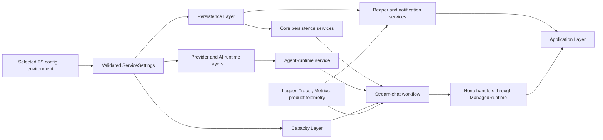

# Effect v4 Rewrite Knowledge Base

Read this when: implementing any rewrite step or verifying an Effect API, boundary, lifecycle, or architectural decision.

Source of truth for: reusable facts and decisions verified for this program.

Not source of truth for: the API of an unselected future Effect release. Step 01 must replace provisional API notes with facts from the pinned v4 declarations.

## Evidence discipline

Effect v4 is version-sensitive. The project began this plan on `effect@4.0.0-beta.70`, while the npm `beta` tag was `4.0.0-beta.97` on 2026-07-10. The unqualified npm `latest` tag still pointed to Effect v3. Therefore, never upgrade using `effect@latest` when the intent is v4.

At implementation time, verify the official v4 repository, npm dist-tags, peer dependency ranges, and installed declarations. Select a coherent exact version set for `effect`, `@effect/platform-node`, and `@effect/vitest`. Pin the set together and record it below.

### Selected baseline

- Effect: pending Step 01
- Platform Node: pending Step 01
- Effect Vitest: pending Step 01
- Official source commit/tag: pending Step 01
- Selection date: pending Step 01
- Known unstable imports: pending Step 01

The ignored `.reference/effect` clone is research material, not a package dependency or source of runtime code. Re-fetch it before using it as current evidence.

## Technology decisions

### Retained boundaries

- Vercel AI SDK remains responsible for model/provider execution, AI SDK tools, and provider-native streaming inside `packages/agent-runtime`.
- Hono remains the inbound HTTP framework in `apps/partner-ai-service`.
- Drizzle and `pg` remain private to `packages/db`.
- `chat-protocol` remains the public `sidechat.v1` contract and stays Effect-free.
- Browser packages stay Effect-free and provider-DTO-free.

Effect improves the interior: workflow composition, dependency requirements, resource ownership, concurrency, cancellation, retry policy, time, errors, configuration resolution, observability, and deterministic tests.

### ADR 0003 disposition

Preserve the containment rule: Effect belongs in core and server workflows and must not leak into browser/public transport packages. Supersede the rule that product ports must be plain-object parameters and that Layer-based dependency injection is unwarranted.

The current `StreamChatPorts` object manually assembles many unrelated dependencies and hides the requirements of individual functions. Manual constructors also distribute acquisition and shutdown. Individual `Context.Service` tags and an application Layer graph make those dependencies and lifecycles explicit.

### No mega service

Do not rename `StreamChatPorts` to `StreamChatServices`. Define a service for each cohesive capability: conversation store, turn store, event log, context preparation, policy, authorization, guard registry, AI runtime, title generation/model-only invocation, ID generation, product telemetry, and other verified port families.

Functions should return `Effect<A, E, R>` with the smallest honest `R`. A higher-level workflow naturally accumulates the union. Tests provide only what the operation needs.

### Optional behavior

Required product capabilities use required services. Provide explicit no-op Layers where behavior is intentionally inert. Use `Context.Reference` only for a universal safe default whose absence cannot hide a wiring error. Never use optional service lookup to make incomplete production composition appear valid.

## Effect v4 feature adoption map

This map prevents two opposite mistakes: rebuilding Effect features by hand and adopting primitives that do not solve a current problem. Exact module/type names must be updated after Step 01 if the selected v4 release renamed them.

| Feature family | Program posture | Intended use or reason |
| --- | --- | --- |
| Typed `Effect<A, E, R>` | adopt throughout core/server | Make success, expected failure, and required services explicit. |
| Generator/do notation and named Effect functions | adopt selectively | Keep lifecycle stages readable; split concept-dense generators into named operations. |
| Context/service-map services | adopt | Replace `StreamChatPorts` with cohesive individually replaceable capabilities. |
| Layer and Layer memoization | adopt | Build Live/Test graphs, share resources once, and encode dependency/resource ownership. |
| ManagedRuntime and NodeRuntime | adopt | Create one Hono adapter and one executable root with explicit disposal. |
| Scope and acquire/release constructs | adopt | Own pools, listeners, queues, registries, streams, exporters, and background fibers. |
| Fiber, FiberMap, and FiberSet | adopt | Own active turns, keyed host waits, and supervised background work. |
| Deferred | adopt | Exactly-once host-command completion, readiness gates, and controlled test synchronization. |
| Queue/Mailbox | adopt where semantics fit | Bounded turn admission and worker handoff after verifying selected-version shutdown/backpressure. |
| Semaphore/partitioned semaphore | adopt | Hold provider/tool permits for the complete protected resource lifetime. |
| Clock, Duration, Schedule, timeout, retry, repeat | adopt | Replace raw timers and encode bounded operation-specific resilience with virtual-time tests. |
| Ref | adopt for simple fiber-safe state | Counters and state machines that do not require effectful atomic updates. |
| SynchronizedRef | adopt only for effectful atomic transitions | Use when Deferred/FiberMap/Queue cannot encode an atomic resolver/registry transition. |
| SubscriptionRef | conditional | Low-frequency readiness/degraded state; do not duplicate event fan-out. |
| Stream | adopt inside runtime/service workflows | Provider drains, notifications, and subscriptions with scope/backpressure; convert at transport edges. |
| Sink/Channel | conditional specialist tool | Use only when Stream combinators cannot express a performance-critical protocol transform clearly. |
| PubSub | adopt | Scoped live event signals and subscriber queues; durable replay stays in the event log. |
| Race, timeout, interruption controls, finalizers | adopt carefully | Resolve competing outcomes and guarantee terminal/resource cleanup without losing cancellation. |
| Cause and Exit | adopt at supervision/test boundaries | Preserve typed failure, defect, and interruption; never expose raw causes publicly. |
| Error accumulation/validation | adopt at boot and batch validation | Report all safe configuration issues without arbitrarily accumulating dependent runtime failures. |
| Schema and Redacted | adopt | Validate resolved settings/boundary errors and protect secrets. |
| Config/ConfigProvider | selective | Resolve environment/default-provider values without duplicating the readable TS config model. |
| Logger, Tracer, Metric | adopt | Native semantic runtime observability through permanent Layers. |
| Supervisor | selective | Observe fibers where valuable; it complements scoped ownership/FiberMap/FiberSet. |
| FiberRef/log/span annotations | selective | Propagate safe infrastructure context; do not hide product inputs or sensitive data. |
| Cache | defer pending measured repetition | Consider only after defining TTL, key cardinality, failure caching, tenant isolation, and measured need. |
| Request/RequestResolver batching | defer pending a real batching seam | Use only when repository reads can batch without violating ordering/transaction semantics. |
| STM/TRef/TQueue | defer | Use only for a verified invariant requiring atomic coordination across multiple independent refs/queues. |
| Schedule cron | do not use for the current reaper | The reaper needs elapsed-time scheduling, not calendar semantics. |
| Effect HTTP API/server | do not adopt | Hono and `chat-protocol` remain the HTTP/public contract boundary. |
| Effect SQL | do not adopt | Drizzle/`pg` and Promise repository contracts remain the persistence boundary. |
| Effect AI | do not adopt | Vercel AI SDK remains the chosen provider/tool/stream runtime. |
| Cluster/workflow/distributed modules | do not adopt without a separate decision | PostgreSQL and the protocol workflow already own turn durability. |

### State selection rule

Prefer the primitive that directly owns the invariant. A one-time result is a Deferred, keyed work is a FiberMap, bounded handoff is a Queue/Mailbox, a permit is a Semaphore, and durable facts stay in PostgreSQL. Use Ref-family state only when no higher-level primitive already encodes the lifecycle. Avoid nested mutable registries guarded by one broad lock.

### Cache and batching entry criteria

Do not add caching or batching as generic “performance architecture.” A proposal must identify the repeated operation, stable key, tenant boundary, invalidation/TTL, error-caching rule, memory bound, observability, and a test or measurement that shows value. Until then, direct typed repository/provider operations are simpler and safer.

## Target dependency graph

The exact graph belongs in Step 08 and may use intermediate Layer modules, but it must remain acyclic. A service cannot be built, then mutated later with a runtime it helped create.

## Resource ownership

### App-owned versus caller-owned persistence

Internally created PostgreSQL repositories and notification connections are app-owned. Acquire them with a scoped Layer and release them when the application scope closes. An injected repository bundle is caller-owned; adapting it into Effect services must not close it.

The current persistence bundle erases this distinction, and the current service shutdown does not reliably close an internally created PostgreSQL repository. Step 06 must add a failing regression test before repair.

### Shutdown ordering

Desired semantic order:

1. stop accepting new HTTP work;
2. drain admitted work for a bounded interval if the configured policy permits;
3. interrupt active turn fibers and let their finalizers persist terminal outcomes;
4. stop reaper and notification listeners;
5. close event registries, queues, and resolver state;
6. flush telemetry exporters;
7. close database pools and connections.

Layer dependency/acquisition order should make this order natural. Do not implement shutdown as unrelated finalizers racing in parallel.

### Managed runtime

Final state has one application `ManagedRuntime`. Hono handlers run Effects through that runtime. The executable is launched with `NodeRuntime.runMain`. `createPartnerAiServiceApp` must not build resources while discarding a release action; delete it or make all callers use an explicitly managed handle.

## Concurrency and background work

Use scopes and structured concurrency by default. Use `FiberMap` when work is keyed and replaces or resolves by key, such as active generation or host-command awaits. Use `FiberSet` for unkeyed owned work. Every long-lived background fiber needs a failure policy and observability.

The recurring reaper should report a failed sweep and continue on an explicit schedule for transient failures. Notification listeners should restart with capped jitter only for classified recoverable source failures; a permanent failure either fails application startup/runtime or enters an explicit degraded state. Never hide the cause with a blanket success fallback.

### Breaking the runtime/tool cycle

The current tool registry is created and later mutated through `bindRuntime`/`runtimeHandle`. Remove this back-reference. Auxiliary jobs that only need a model call should depend on a `ModelOnlyInvoker` service that does not depend on the runtime tool registry. If a real cycle remains after that split, use a composition-owned `Deferred` only as a documented last resort, never a mutable nullable field.

## Capacity model

Capacity has distinct scopes:

- Turn admission limits running workflow count and bounds queued starts. A request that cannot enter within the configured queue timeout fails with `TurnCapacityError`. Do not create a durable `running` turn before capacity is granted.
- Provider execution limits model streams, optionally partitioned by provider/model. A permit is held for the full stream lifetime, including consumption and terminal cleanup, not only until the stream object is returned.
- Pending host commands are bounded to prevent unbounded resolver state.
- Runtime tool execution is bounded globally and, where justified, by tool category.

Do not use one global semaphore as a substitute for these different policies. Record queue size, timeout, and concurrency limits in validated settings and expose low-cardinality metrics.

## Time, retry, timeout, and cancellation

Use the built-in Effect `Clock`; tests use `TestClock`. Keep raw `setTimeout` out of Effect-owned server code. An isolated AI SDK delta coalescer may retain a timer only if adapting it would blur the AI SDK boundary and its lifecycle remains tested.

Every retry requires an ownership decision and idempotency proof:

| Operation | Retry policy |
| --- | --- |
| Lease acquire/renew | retry only classified transient storage errors; bounded, jittered schedule |
| Notification source | reconnect classified transient failures; capped jitter; observable state |
| Provider call before first emitted event | optional retry for typed transient provider failure |
| Provider call after any delta, tool call, or side effect | never retry the turn automatically |
| Host-command wait | poll on schedule until notify, timeout, abort, or terminal persisted result |
| Title generation | bounded timeout; failure cannot hang or fail turn finalization |
| Repository write with unclear idempotency | do not retry until operation contract proves safety |

AI SDK internal retries remain disabled (`maxRetries: 0`) so the product workflow owns retry semantics.

Cancellation has three ownership domains. A start-response disconnect after the turn is admitted does not cancel server-owned generation. A resumed SSE disconnect interrupts only that subscriber's replay/live fiber. Explicit durable cancel, lease loss, or application shutdown interrupts the generation fiber and propagates through Effect interruption to AI SDK `AbortSignal`, stream drain, tool execution, host waits, heartbeat, and terminal persistence.

## Event fan-out architecture

Use Effect PubSub for process-local live turn-event signals. It provides scoped subscriptions, bounded queues, shutdown, and backpressure/drop primitives that the custom dispatcher would otherwise reimplement. Keep the durable event log authoritative: PubSub is a live wake-up/delivery primitive, not the replay record.

The implementation must preserve:

- replay from the durable event log;
- dense sequence ordering;
- no duplicate terminal event;
- slow-subscriber behavior and dropping semantics;
- reconciliation after a dropped live signal;
- cancellation and resource release when subscribers leave;
- finite PubSub capacity and an explicit overflow strategy.

Step 13 writes one new event-stream service composed from the event log and a private PubSub, cuts composition directly to it, and deletes the custom dispatcher. It does not add an old-to-new compatibility bridge or reopen adoption.

## Failure taxonomy

Use tags based on ownership and recovery, not filenames. The exact names may change during Step 04, but the model should distinguish at least:

- request/policy failures: authorization, invalid request, conversation busy, policy denied, guard rejected;
- core dependency failures: context preparation, conversation store, assistant-turn store, event log, title generation;
- runtime failures: provider selection, provider execution, tool execution, invalid provider stream;
- service failures: configuration, persistence initialization, notification source, host-command await, capacity;
- interruption/defect: separate from expected tagged failures and never exposed raw.

An `AiRuntimeError` should carry a stable code/operation, retryability, and safe public message while retaining its internal cause privately. Remove `unknown` from owned port error channels. Map pre-stream failures to HTTP/protocol once; map post-start failures to one terminal event once.

If the selected Effect version supports the intended `Schema.TaggedErrorClass` API, prefer schema-backed boundary errors where encoding/decoding is valuable. Reverify the API after Step 01.

## Configuration and secrets

Keep the TypeScript configuration surface as the human-readable behavior source. The pipeline is:

1. select the configured TS module;
2. resolve environment references through a composition adapter;
3. wrap secrets in `Redacted` before they enter services;
4. validate the resolved boot model with Schema, including cross-field rules;
5. accumulate and report all safe boot issues;
6. provide immutable `ServiceSettings` through a Layer.

Do not duplicate the complete TS config shape in Effect `Config`. Use `Config` where it improves environment/default-provider handling; use Schema for the resolved boot contract.

## Observability

Retain a product-safe telemetry service for domain events and provide an explicit no-op Layer. Add native Effect Logger, Tracer, and Metric Layers for runtime behavior. Semantic spans belong around turn admission, preparation, provider execution, tool execution, persistence commit, stream terminalization, and background sweeps—not around tiny helpers or each delta.

Metrics must use low-cardinality labels. Never label metrics with conversation, turn, user, request, command, or tool-call IDs. Logs, spans, tests, and protocol errors must not contain prompts, retrieved content, model output, raw tool payloads, secrets, database URLs, or raw provider errors.

An OTLP exporter may use Effect's unstable observability modules only behind one adapter. Pin and reverify that adapter on every v4 upgrade.

## API notes to reverify after Step 01

The beta.70 audit confirmed these concepts existed, but these are not permanent signatures:

- `Context.Service` and `Context.Reference`;
- `Layer.succeed`, `Layer.effect`, merge/provide, memoization, and launch behavior;
- `ManagedRuntime.make` with run and dispose operations;
- `NodeRuntime.runMain`;
- `FiberMap`, `FiberSet`, `Deferred`, `Semaphore`, and partitioned semaphore support;
- Effect timeout/retry combinators and jittered schedules;
- `Effect.fn` tracing helpers;
- `@effect/vitest` Effect/scoped tests and `TestClock`;
- scoped Stream construction;
- unstable OTLP observability modules.

Step 01 must replace this list with exact imports and signatures from the selected baseline. Later agents must not guess names such as `Layer.scoped`, `Stream.acquireRelease`, or `Stream.unwrapScoped`; verify the declarations.

## Run-boundary target

Allowed production execution boundaries:

- `NodeRuntime.runMain` at the executable root;
- the application `ManagedRuntime` bridge used by Hono;
- an AI SDK Promise/AbortSignal tool adapter where the third-party callback requires a Promise.

Forbidden final-state patterns:

- `Effect.runSync` or `Effect.runPromise` inside core/service constructors or workflow modules;
- manual `Scope.make`/`Scope.close` in service owners;
- fallible I/O wrapped with `Effect.promise` instead of typed `tryPromise`/adapters;
- unobserved forked fibers;
- fire-and-forget `Effect.runPromise(...).catch(...)`;
- duplicated Promise wrappers for the same repository operation;
- runtime services mutated after construction.

Step 16 adds automated governance for these rules.

## Reusable verification suites

1. AI runtime conformance: provider selection, stream mapping, tool loop, cancellation, terminal semantics, and no retry after emission.
2. Stream-chat workflow conformance: policy, context, lease, runtime drain, persistence, title isolation, terminalization, and service requirement substitution.
3. Service lifecycle/streaming conformance: HTTP mapping, replay/live transition, disconnect, cancel, background behavior, and shutdown.
4. Resource lifecycle probes: partial acquisition failure, release exactly once, Layer memoization, runtime isolation, repeated dispose, and caller-owned resource preservation.

Contract suites must run against both Live-like deterministic Layers and focused test Layers where meaningful. They assert observable behavior, not the specific combinator used.

## Migration discipline

Each step remains green. If a temporary bridge is necessary, it has one composition switch, an owner, and a deletion criterion in the same step or a named later step. Never operate two resource owners for the same concern. No public protocol or database schema change is implied by this rewrite; authorize such changes explicitly if evidence proves one is necessary.

No live provider request or non-disposable database operation is part of routine verification. Release certification may include a real-provider smoke test only with explicit user direction and safely scoped credentials.
