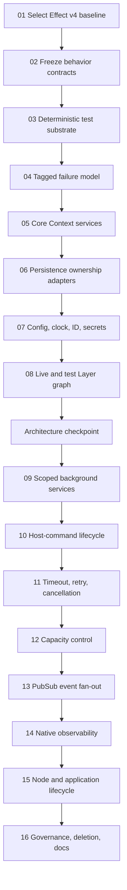

# Effect v4 Ground-Up Architecture Program

Read this when: planning, implementing, reviewing, or resuming the Effect v4 rewrite.

Source of truth for: the rewrite target, step order, shared rules, completion evidence, and handoff protocol.

Not source of truth for: current production behavior, public protocol semantics, database schema, or the Effect API selected at execution time. Until a step updates canonical documentation, current behavior remains defined by the code and `docs/` sources linked below.

## Outcome

Rebuild the server and product-workflow interior as an idiomatic Effect v4 system while retaining Vercel AI SDK, Hono, and Drizzle/PostgreSQL at their existing technology boundaries. The final system has typed service requirements, composable Layers, scoped resources, structured concurrency, explicit capacity and retry policy, native Effect observability, deterministic tests, one application runtime, and narrow Promise/stream adapters.

This is a ground-up rewrite program, not a compatibility-preserving migration. Prefer deleting and rebuilding a whole ownership module when that produces a simpler final design. A new implementation may exist off the active path while it is tested, but do not build old-to-new compatibility bridges or preserve legacy APIs. Composition selects exactly one path, then the replaced module is deleted in the same step whenever practical.

## Non-negotiable decisions

- Keep Vercel AI SDK as the provider/runtime integration. Do not migrate to Effect AI.
- Keep Hono as the HTTP framework and Drizzle/PostgreSQL as persistence technology.
- Keep `side-chat-widget`, `host-bridge`, `chat-protocol`, and shared browser packages free of Effect and provider DTOs.
- Keep provider-native types and AI SDK stream parts private to `packages/agent-runtime`.
- Replace the internal `StreamChatPorts` registry with individual Effect services and real `R` requirements.
- Build one application Layer and one `ManagedRuntime`; start the executable with `NodeRuntime.runMain`.
- Use Effect PubSub as the scoped live fan-out primitive; keep the durable event log authoritative for replay and reconciliation.
- Use native Effect Logger, Tracer, and Metric Layers. Only the external telemetry exporter is optional.
- Model app-owned resources with scoped Layers. Injected repositories remain caller-owned.
- Preserve public `sidechat.v1` behavior unless a step explicitly authorizes and tests a contract change.
- Keep `sidechat.config.ts` human-readable. Environment resolution, secrets, and validated runtime settings become services without creating a second configuration language.
- Do not preserve old APIs merely to reduce migration work. This repository is pre-production and the target architecture takes priority.

## Program map

The order is architectural dependency order. A later step may prepare a branch while an earlier one is under review, but it must not merge or change the active composition path until every dependency is complete.

## How an agent executes a step

1. Read this file, [`STATUS.md`](./STATUS.md), [`KNOWLEDGE.md`](./KNOWLEDGE.md), the selected step, and every canonical document named by that step.
2. Inspect `git status --short` and the current implementation. Paths and symbols in plans are anchors, not permission to assume the code is unchanged.
3. Reverify every Effect API against the pinned installed declarations and the official v4 reference clone. Do not translate from Effect v3 memory or the public Effect AI introduction.
4. Change the step status to `in_progress` in `STATUS.md`, record the owner and date, and add a short execution note.
5. Implement only the target state and any temporary bridge explicitly permitted by the step. Keep one active implementation at composition roots.
6. Run the focused contract tests first, then the required repository gates. Fix failures instead of weakening tests or rules.
7. Update canonical docs in the same change when the step alters ownership, lifecycle, vocabulary, configuration, protocol behavior, or verification.
8. Record evidence and deviations in the step file. Update `KNOWLEDGE.md` only for reusable, verified facts.
9. Mark a step `complete` only when its checklist and gates pass and no temporary residue assigned to that step remains.

## Shared implementation rules

### Boundary policy

Effect owns the product workflow and server resource lifecycle. Promise, `AbortSignal`, `ReadableStream`, and `AsyncIterable` conversions live at Hono, AI SDK, database, or browser transport edges. Do not spread boundary representations through core workflows to avoid one adapter.

Keep record repository contracts Promise-based and wrap each operation once in a typed Effect service adapter. Keep the existing Effect capability in `packages/db` for scoped notification Streams and reconnect logic, where Effect directly owns lifecycle and scheduling. Do not replace those tested primitives with a custom callback or AsyncIterable layer merely to make the package Effect-free.

### Service policy

Define small services next to the port shapes they own. Do not replace `StreamChatPorts` with a single mega-service. Functions must expose their actual service requirements. Required product behavior uses required services; safe universal defaults may use `Context.Reference` only when absence cannot hide a composition error. Prefer explicit no-op test/live Layers over optional service lookup.

Use Effect's built-in `Clock` for time and `TestClock` for deterministic tests. Keep ID generation as a custom service because domain IDs and deterministic sequences are product concerns.

### Resource and concurrency policy

Every long-lived fiber, listener, pool, queue, semaphore, and registry belongs to a scope. Layer acquisition must encode ownership and shutdown ordering. No service constructor may create a resource and discard its release action.

Background work needs an explicit failure policy: restart with a bounded schedule, degrade with diagnostics, or fail the application. `catchCause` must not silently turn an unknown cause into success. Forked work must be supervised or stored in an owned `FiberMap`/`FiberSet`.

### Failure policy

Owned boundaries use tagged errors with safe public fields and private causes. `unknown` is not an owned port error type. Map expected failures with `catchTags`; reserve cause-level handling for process and fiber safety. HTTP maps pre-stream failures once. After streaming starts, failure becomes one terminal protocol outcome.

### Test policy

Tests assert behavior and lifecycle, not Layer implementation details. Reusable conformance suites cover runtime behavior, stream-chat workflow, service lifecycle/streaming, and resource acquisition/release. Use `@effect/vitest`, `TestClock`, deterministic IDs, scripted streams, and disposable infrastructure.

Do not use active Node handle inspection as the primary leak proof. Use release probes, abortable fake resources, bounded completion, listener counts, and repeated acquire/dispose tests.

### Final-state policy

There is no permanent dual architecture and no compatibility layer between old and new modules. Never run old and new reapers, listeners, turn runners, or host-command resolvers together. Build a replacement off-path when necessary for tests, cut composition directly to it, and delete the replaced module in that step whenever practical. Step 16 verifies that no residue remains and makes governance reject its return.

## Architecture checkpoint after Step 08

Before lifecycle behavior is rebuilt, a reviewer must confirm:

- core operations require individual services rather than `StreamChatPorts`;
- the Layer graph has no cycle and no mutable runtime back-reference;
- app-owned and caller-owned persistence have distinct acquisition paths;
- configuration and secrets cross the composition boundary once;
- tests can replace time, IDs, repositories, runtime, and observability independently;
- no production service/core module calls an Effect run function;
- the graph has a credible shutdown order.

Record approval or corrective work in `STATUS.md`. Do not start Step 09 with an unresolved checkpoint.

## Canonical references

- [`docs/architecture/effect.md`](../../docs/architecture/effect.md)
- [`docs/architecture/system-map.md`](../../docs/architecture/system-map.md)
- [`docs/architecture/package-boundaries.md`](../../docs/architecture/package-boundaries.md)
- [`docs/architecture/assistant-turn.md`](../../docs/architecture/assistant-turn.md)
- [`docs/architecture/runtime-and-protocol-events.md`](../../docs/architecture/runtime-and-protocol-events.md)
- [`docs/operations/configuration.md`](../../docs/operations/configuration.md)
- [`docs/operations/verification.md`](../../docs/operations/verification.md)
- [`docs/adr/0003-effect-as-core-effect-system.md`](../../docs/adr/0003-effect-as-core-effect-system.md)

ADR 0003 remains historical evidence. Its Effect-containment decision remains valid. Its decision to keep internal product ports as plain objects and avoid Layer-based dependency injection is intentionally under challenge and is expected to be superseded by this program.

## Files in this program

- [`STATUS.md`](./STATUS.md): ownership, state, dependencies, evidence, and blockers.
- [`KNOWLEDGE.md`](./KNOWLEDGE.md): verified architecture facts, API policy, decisions, and reusable implementation guidance.
- `01` through `16`: executable implementation steps. Each file defines its target state, detailed sequence, affected seams, contract tests, gates, and completion evidence.

## Completion definition

The program is complete when all 16 steps and the architecture checkpoint are complete, the full pinned repository gate passes, canonical documentation describes the new architecture as current state, no legacy composition path remains, and a clean start/serve/stream/cancel/shutdown lifecycle is proven with deterministic tests and a disposable integration run.
