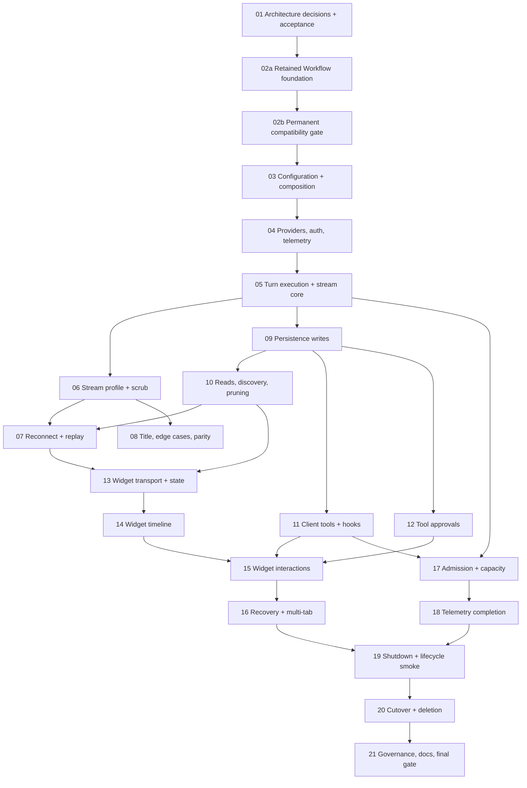

# AI SDK 7 Native Rewrite Program

Read this when: planning, implementing, reviewing, or resuming the SDK-native rewrite.

Source of truth for: the rewrite target, step order, shared rules, execution-substrate gate, and handoff protocol.

Not source of truth for: current behavior (the running code and `docs/` own that until cutover) or future SDK APIs (installed declarations, ignored source clones, and [`KNOWLEDGE.md`](./KNOWLEDGE.md) own the verified baseline).

## Outcome

Rebuild Side Chat on AI SDK 7 native primitives: agent loop, UI message stream, tools, approvals, timeouts, telemetry, and—when the compatibility contract passes—durable Workflow execution. Side Chat keeps only product concerns the SDK cannot own: authentication, tenancy/ownership, policy, privacy scrubbing, conversation records, widget/design-system behavior, and host-page integration.

The strategy is a **greenfield wing with one cutover**, not an in-place migration. `apps/side-chat-service` is built v7-native inside this repository. The old path remains an unchanged behavior reference until Step 20, then replaced packages and modules are deleted. There is no compatibility bridge, dual protocol, or v6-to-v7 codemod phase.

## Decisions already made

- **AI SDK 7 is the core, unconditionally.** It owns every concept it already implements. Custom infrastructure must justify itself.
- **WorkflowAgent is the default durable execution substrate.** Steps 02a–02b build retained code and permanently test its self-hosted guarantees.
- **The fallback is still AI SDK 7.** If a load-bearing Workflow invariant fails, the new service uses `ToolLoopAgent` with request-bound single-instance execution. It does not retain the old custom runtime, build custom durability/multi-instance machinery, reintroduce Effect, or coexist behind a bridge.
- **Plain TypeScript in the new wing:** constructor/function injection, zod, `AbortSignal`, and async/await. No Effect imports.
- **Strict SDK naming:** use `UIMessage`, `UIMessageChunk`, tools, approvals, runs, hooks, and transports where the SDK owns those concepts.
- **Native feature shapes:** redesign or cut old features instead of recreating a shadow protocol. Use `data-*` only for a named product concept with no native representation.
- **Public wire contract:** UI message stream `v1` plus a documented Side Chat profile for safe errors, justified `data-*` parts, auth, and routes.
- **Disposable pre-alpha data:** reset schemas; do not write migration bridges for old data.

## Step sizing and estimate

Each file is one coherent milestone with anchors, tests, verification, and handoff evidence. If its test matrix cannot be completed well in one focused session, split it before implementation and add suffix files/status rows; never degrade the result to preserve numbering.

Expected effort is **27–32 focused agent sessions**, with a plausible **25–36** range. The board has 22 milestones because some later feature milestones may require recorded suffix splits. The main uncertainty is product-policy and widget parity work around native parts, not whether AI SDK 7 is the core.

## Program map

After Step 05, the turn, persistence, and tools lanes can proceed where their declared dependencies allow. The widget lane starts after reconnect and discovery contracts exist.

## Execution-substrate gate

AI SDK 7 adoption is not gated. Step 01 records the architecture; Step 02a creates the real foundation; Step 02b retains permanent tests and selects exactly one execution substrate:

- **Workflow (expected):** WorkflowAgent + Workflow DevKit + Postgres World, with durable runs, crash recovery, multi-instance continuation, replay, and hooks.
- **Fallback:** ToolLoopAgent in the new service, with native stream/tools/approvals/timeouts/telemetry but deliberately request-bound single-instance semantics.

Only failures of build/boot, crash recovery, cross-instance continuation, reconnect coherence, or prompt provider cancellation can select fallback. Approval gaps, deployment constraints, write amplification, telemetry maturity, or inspector quality are owned and repaired by later steps; they do not justify rebuilding an execution engine.

The compatibility suite remains and reruns on Workflow dependency upgrades. The gate must delete the unselected substrate—never ship both behind an abstraction.

## How an agent executes a step

1. Read this file, [`STATUS.md`](./STATUS.md), [`KNOWLEDGE.md`](./KNOWLEDGE.md), and the step file.
2. Verify SDK/Workflow APIs against installed declarations and `.reference/ai-sdk-v7` / `.reference/workflow`. Reverify after every version bump.
3. Update `STATUS.md` owner/state before and after work.
4. Keep the old app unchanged and green until Step 20.
5. Record evidence/deviations in the step handoff; put only reusable verified facts in `KNOWLEDGE.md`.
6. Follow repository readability/security rules. No Effect in the new wing.

## Shared boundary rules

- Only the server runtime constructs provider instances and agents. Never pass a string model id.
- Browser packages may use AI SDK UI types but never provider DTOs/packages.
- Authenticate and verify tenancy/ownership before access to runs, streams, hooks, approvals, or tool results.
- Never expose raw provider errors, prompts, secrets, or private tool payloads to the browser or telemetry.
- Convert representations once at their owning edge; do not recreate RuntimeEvent-style shadow vocabularies.

## Required configuration

1. Explicit timeout; no SDK-default infinite provider wait.
2. `maxRetries: 0` inside Workflow steps; one retry owner.
3. Explicit `stopWhen` step cap.
4. SSE keepalive at the transport edge.
5. Safe `onError` mapping.
6. Provider-instance assertion.
7. Workflow journal archive/prune policy on the Workflow substrate.

## Test policy

Use deterministic Vitest tests and scripted providers; no real provider calls in the default suite. Step 02b is permanent architecture conformance. Later tests own feature behavior rather than relying on an early experiment. Old/new parity is a Step 08 decision checklist: prefer native behavior and record deliberate differences.

## Relationship to `plan/effect`

This program leaves `plan/effect` byte-identical as historical research material. It supersedes that plan's runtime jurisdiction if cutover completes because AI SDK/Workflow owns the same infrastructure concerns. Canonical architecture docs and `plan/v7` status—not edits inside the old plan—record the final architecture.

## Files

- [`STATUS.md`](./STATUS.md): state, ownership, substrate verdict, evidence.
- [`KNOWLEDGE.md`](./KNOWLEDGE.md): verified facts, gotchas, baseline, rationale.
- `01`, `02a`, `02b`, and `03`–`21`: executable milestone contracts.

## Completion definition

The new wing serves the widget end to end through the native protocol; the selected substrate passes permanent compatibility and lifecycle tests; replaced packages and the old app path are deleted; governance enforces the new boundaries; canonical docs describe current state; and the full pinned repository gate passes.
